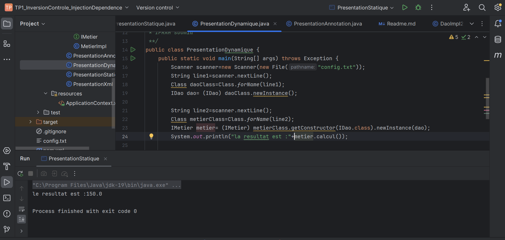
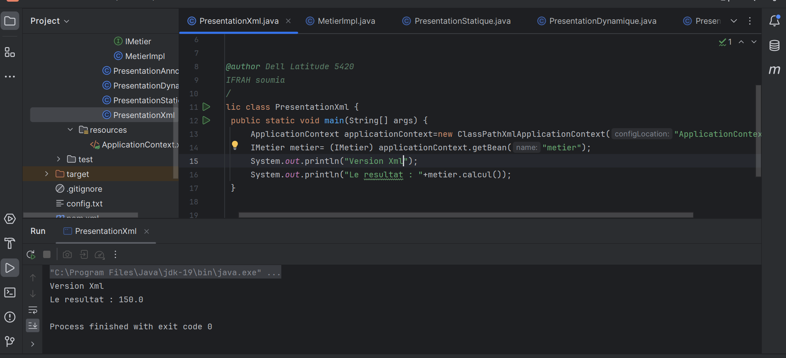

# Compte rendu TP JEE Inversion de contrôle et Injection de dépendance

Ce repository contient le compte rendu du TP sur l'inversion de contrôle et l'injection de dépendance en JEE.

## Présentation Statique

Cette section présente l'implémentation statique du TP.

## Présentation Dynamique

Dans cette partie, nous mettons en avant la version dynamique de l'implémentation du TP.

## Présentation version XML

La présentation XML montre une autre façon d'implémenter les concepts d'inversion de contrôle et d'injection de dépendance.

## Présentation version Spring Annotation

Enfin, cette section présente la version utilisant les annotations Spring pour l'inversion de contrôle et l'injection de dépendance.

---
Ce compte rendu a été réalisé dans le cadre de notre TP JEE sur l'inversion de contrôle et l'injection de dépendance.
